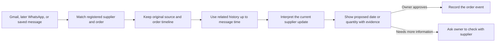

# ProcureBrain

**Status: under active development.** ProcureBrain is a learning project for a small-business owner who tracks supplier orders. It is designed to collect supplier messages, match them with purchase orders, show a source-linked timeline, and prepare a delivery-date or quantity change for the owner to review.

The Gmail connector, WhatsApp Business text receiver, signed message intake, bounded supplier history, and review dashboard are implemented in code. They are not yet verified against a real Gmail or WhatsApp account. Gmail still needs Google Cloud setup and owner consent. The project is not a finished or production-ready service. See [connected channels and the setup checklist](docs/CONNECTED_CHANNELS.md).

## The problem and intended workflow

A supplier may change an order's delivery date in an email or message. The owner then has to notice it, identify the order, and update a separate record. ProcureBrain is intended to collect that evidence and prepare the right order change, while leaving the final decision to the owner.



The AI proposes a change; it does not update an order by itself. The owner must review and approve the change. This project has no WhatsApp replies or automatic supplier negotiation.

## What is implemented

- Purchase order and activity CSV import, order timelines, source records, and deterministic attention checks.
- Supplier message storage with source IDs, deduplication, matching, background analysis, and proposal review.
- Gmail read-only OAuth setup, one-minute polling, recent message history, incremental sync checkpoints, and pause/resume controls. A real account has not been connected or validated.
- A WhatsApp Business webhook for signed **text messages**. It is not connected to a WhatsApp account; personal chat, voice, image, and document intake are not supported.
- A signed inbound message format that another integration can use. Ready-made Outlook and other mailbox connectors are not implemented.
- Source-linked supplier history and bounded context for AI analysis. The context uses up to eight relevant earlier messages and twelve earlier order events, before the current message time. It does not train a supplier-specific model or measure supplier reliability.
- Review safeguards for unclear changes, unread attachments, and an older message that arrives after a newer update. The owner remains responsible for checking evidence.
- An under-development dashboard with Home, Orders, Messages, Check changes, Email alerts, Suppliers, and a Connections page.
- Synthetic AI extraction data and authored purchasing workflow scenarios. The workflow scenarios use supplied extraction results; they do not measure a live model's accuracy.

## Project state and limitations

- Gmail and WhatsApp have **not** been connected to real accounts. No live message retrieval was validated in this iteration.
- Gmail's requested `gmail.readonly` scope is restricted by Google. A public Gmail integration may need Google's verification and security assessment. Check current requirements before offering it to other users.
- No real supplier data or representative, permissioned supplier-email set has been evaluated. The recorded synthetic extraction benchmark is not a real-world accuracy claim. See [evaluation notes](packages/ai/README.md#pairing-an-email-with-po-context).
- Historical Gmail messages are saved as history; they are not automatically sent to AI. New messages go to the configured AI provider for analysis. The app stores only messages that match a registered supplier, but the OAuth permission itself covers Gmail message reading.
- Gmail text/plain is preferred. HTML-only message bodies are kept as raw text, and attachment contents are not read.
- A persistent PostgreSQL database is needed for messages and sync checkpoints to survive restarts. In-memory demo data is lost when the API restarts.
- Owner authentication, complete organization isolation, retention/deletion controls, monitoring, real email delivery validation, and production deployment remain unfinished.

## Run locally

Requirements: Node.js, pnpm 9, and optionally PostgreSQL for persistent storage.

```bash
pnpm install
cp .env.example .env
```

Configure an AI provider in the local `.env` if you want to analyze messages. Start the API and web app in separate terminals:

```bash
pnpm --filter @procurebrain/api dev
pnpm --filter @procurebrain/web dev --host 0.0.0.0
```

Open <http://localhost:5173>. Without `DATABASE_URL`, the app uses temporary in-memory records. To set up Gmail later, follow the [connected-channel guide](docs/CONNECTED_CHANNELS.md); never place credentials in Git or chat.

## Learn the project

- [Problem statement and demo story](docs/PRODUCT_STORY.md)
- [System architecture and connector setup](docs/CONNECTED_CHANNELS.md)
- [Project status and next steps](docs/PROJECT_STATUS.md)
- [Purchasing agent walkthrough](docs/AGENT_HARNESS.md)
- [Dataset, labels, and accuracy limits](packages/ai/README.md)
- [Purchasing practice cases](docs/PURCHASING_PRACTICE_GUIDE.md)
- [Recorded workflow evaluation](docs/evaluations/2026-10-06-purchasing-agent.md)
- [Dashboard guide](docs/DASHBOARD_UI.md)

## Development checks

```bash
pnpm typecheck
pnpm test
pnpm build
```

The commands above are available for contributors. Passing workflow checks with fixture outputs does not establish AI accuracy or a successful live connector. Real-world evaluation needs representative, permissioned, independently labeled supplier messages.

## CV wording while the project is in progress

**ProcureBrain — Supplier Update Review Agent (Under Development)**

- Building a purchasing workflow that links supplier messages to purchase orders and prepares source-backed delivery-date or quantity changes for owner approval.
- Implemented Gmail read-only synchronization, supplier-history context, message deduplication, and review safeguards; awaiting Google OAuth setup and live-account validation.
- Designed an extensible signed-message intake and WhatsApp Business text webhook; external channel setup and production security remain in progress.
- Evaluated deterministic workflow scenarios with fixture extraction outputs; this result does not measure model accuracy.

Use the last two bullets only if you can explain the current limitations in an interview. Do not describe Gmail as connected or present the workflow-case pass rate as AI accuracy.

## License

No license has been added. Until the author chooses one, all rights are reserved.
