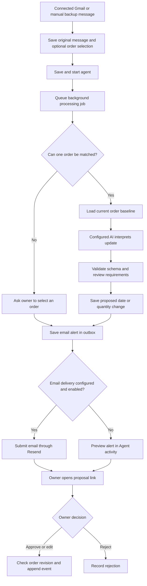

# ProcureBrain personal purchasing agent

Status: local prototype, October 6, 2026. Background processing and an email outbox are implemented. Live email delivery and PostgreSQL recovery have not been exercised in this iteration.

## Product job

A small-business purchasing owner misses supplier delivery-date changes arriving in different places. ProcureBrain keeps the original update, matches its purchase order, prepares a proposed date or quantity change, and alerts the owner to review it. The order changes only through the existing approve or edit-and-approve commands.

The owner chose **Gmail first, email alerts first, and WhatsApp later**. Gmail read-only polling and setup code, WhatsApp Business text intake, and a signed generic message receiver are implemented but not connected to live accounts. Gmail still needs Google Cloud setup and consent. Manual message capture remains available as a backup. See [Connected supplier messages](CONNECTED_CHANNELS.md) for accurate setup steps and limits.

## Current loop



No changed date or quantity means the job completes without a change alert when interpretation is valid. Unclear matching, invalid extraction and low-confidence messages without an approvable field produce clarification alerts. Combined date and quantity changes also request clarification: the current proposal model cannot apply both fields together. Invalid or uncertain extracted changes retain the existing review state and approval gates; an email is not proof that a proposal is safe to apply.

## What the harness actually does

- The API worker polls every two seconds, processes one message at a time, and continues with the dashboard closed **while the API server remains running**.
- A message job reuses the existing deterministic matching, selected order context, extraction adapter, analysis cache and proposal creation logic. OpenRouter remains supported through the configured provider.
- Model HTTP requests time out after 90 seconds. Work has up to three attempts with 15/30-second retry delays. Model/provider billing can still occur on a timed-out request; this is not a spend budget.
- Jobs and email intents have stable deduplication keys. Retries do not intentionally create a second business alert. Without an external identity, identical text in the same organization/channel uses the existing content-based identity. Different text under one external message identity is rejected rather than replacing evidence.
- PostgreSQL claims use row locking, two-minute leases and a heartbeat every 30 seconds. Writes check the lease token. Pending jobs survive restarts when PostgreSQL is configured. Memory mode loses all records on restart.
- Notification intent is saved before the job is completed. A crash can resume processing and reuse its intent. Proposal creation and outbox creation are separate operations, rather than one database transaction.
- Email destination and sender come from server configuration, never supplier text. The first send freezes its recipient and body and saves a provider receipt on success.
- Resend requests use a stable idempotency key. Keys have a limited retention period; the worker refuses uncertain retries older than 23 hours rather than promising exactly-once external delivery. Inspect the provider before handling such an alert manually. See [Resend idempotency documentation](https://resend.com/docs/dashboard/emails/idempotency-keys).
- `ACCEPTED` means the provider accepted the request. It does **not** establish inbox delivery. Delivery webhooks are not implemented.
- The worker has no approve command. Existing API and MCP approval routes still need authenticated owner identity before public business use; an organization header is not authentication.

## How to use it locally

1. Import an order and its baseline date using the existing CSV import, or select an existing order.
2. Capture the full supplier message. If known, select the purchase order before starting the agent.
3. Choose **Save & start agent**. **Save message** saves evidence without starting processing.
4. Open **Agent activity** to inspect jobs and prepared email alerts. The dashboard refreshes every five seconds.
5. If order matching needs review, select its order in **Messages** and choose **Check message** again. If interpretation is unclear, inspect the original update and obtain confirmed facts; selecting an order does not resolve an uncertain date or quantity.
6. Open its proposal, inspect the original message and before/after values, then approve, edit, or reject.
7. Failed analysis can be retried from the inbox. Failed emails have a **Retry email** action in the outbox; old uncertain sends remain blocked for manual investigation.

Saving and queueing are two HTTP operations. If queueing fails, the saved message remains available to retry. Restarting the process also stops the worker; a running deployment is needed for continuous operation.

## Email configuration

Set these in your local `.env`; never commit real credentials:

```dotenv
PROCUREBRAIN_AGENT_ORG=org-dev
PROCUREBRAIN_EMAIL_ENABLED=false
RESEND_API_KEY=your-local-secret
PROCUREBRAIN_EMAIL_FROM=ProcureBrain <alerts@your-verified-domain.example>
PROCUREBRAIN_EMAIL_TO=your-address@example.com
PROCUREBRAIN_WEB_URL=http://localhost:5173
```

Restart the API after configuration changes. With delivery disabled or settings missing, alerts remain `AWAITING_CONFIGURATION` and are visible in the dashboard. Setting `PROCUREBRAIN_EMAIL_ENABLED=true` with complete settings allows the worker to send queued alerts, including earlier preview alerts. Enable it only when those alerts and the recipient are ready.

Resend requires appropriate sender setup; see [the send email API](https://resend.com/docs/api-reference/emails/send-email). A localhost link opens only where that workspace is reachable. A phone or external email recipient will need a reachable deployment, with authentication added before exposure of business records.

`DATABASE_URL` enables the PostgreSQL store and migration `0006_agent_runtime.sql`. Otherwise this is a temporary local demonstration. The worker is scoped to one configured organization and recipient, rather than a multi-user notification service.

## Code map for learning

| File | Responsibility |
| --- | --- |
| `apps/api/src/agent/repository.ts` | Memory/PostgreSQL queue, deduplication, leases, retries and outbox records |
| `apps/api/src/agent/runtime.ts` | Background loop, bounded retries, email preview/live mode and Resend adapter |
| `apps/api/src/app.ts` | Message capture, queue API, matching/extraction/proposal commands and notification summary |
| `apps/api/src/runtime.ts` | Storage configuration, migrations, worker startup and shutdown |
| `apps/web/src/pages/messages.tsx` | Manual capture and starting/restarting analysis |
| `apps/web/src/pages/agent.tsx` | Job activity, email previews and failed email retry |
| `apps/web/src/pages/reviews.tsx` | Owner decisions and source inspection |

The AI interprets language. The harness is the surrounding software that remembers work, controls when it runs, limits retries, calls permitted operations and records outcomes. This first version is an event-driven purchasing workflow; general conversation memory, autonomous supplier negotiation and scheduled follow-ups are not implemented.

## Remaining work and evidence

- Configure and exercise live email with the owner's actual sender and recipient.
- Exercise PostgreSQL migration, restart recovery, duplicate work, concurrent workers and failed sends. These are not completed validation results.
- Add authenticated owner access and complete tenant boundaries.
- Complete Google Cloud setup and validate real Gmail polling. Add forwarding or a ready-made mailbox connector only if owners need it.
- Evaluate extraction and review routing on representative supplier messages; this feature adds no new accuracy result.
- Add scheduled purchasing reminders, quiet hours and outcome confirmations.
- Configure and validate the WhatsApp Business text receiver later if needed. It does not send WhatsApp alerts; a separate outbound notification feature remains future work. See [Connected supplier messages](CONNECTED_CHANNELS.md).

The October 6 practice pack now exercises capture, matching, proposal creation, email previews and owner decisions with mocked extraction; fake email-provider tests cover send retries and acceptance. See [the evaluation record](evaluations/2026-10-06-purchasing-agent.md) and [practice guide](PURCHASING_PRACTICE_GUIDE.md). Live AI interpretation, real email delivery and real PostgreSQL recovery remain unverified.
