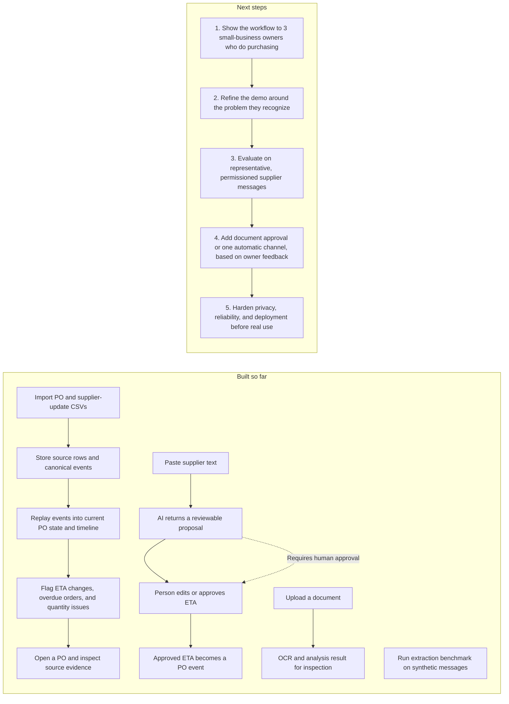

# ProcureBrain: project status and next steps

**Audience:** a small-business owner who handles purchasing themselves.  
**Status:** early prototype; pasted-text ETA changes can now be reviewed and approved, while automatic channel connections and target-user validation remain incomplete.

## Map: built so far and what comes next

## What is implemented

- CSV import for purchase orders, supplier ETA updates, receipts, and follow-ups.
- Event replay into a current PO view and timeline.
- Deterministic attention rules for ETA changes, overdue POs, quantity shortfalls, receipt shortfalls, and overdue follow-ups.
- Source records retained and linked from timeline events.
- Pasted supplier-text analysis that proposes an ETA change for a selected PO; the owner can edit and approve it, recording a source-linked event.
- Document upload OCR and analysis that returns a result for inspection; applying a document-derived proposal is not connected yet.
- A first extraction benchmark on a 60-message **synthetic** holdout. It recorded 45% exact complete-record match and found weak review routing. This does not measure performance on real supplier traffic; see the [evaluation report](evaluations/2026-09-30-holdout.md).
- A product story and simple demo flow aimed at the small-business owner who handles purchasing.

## What is not complete

- The target problem is still a hypothesis. There is no recorded feedback from small-business owners confirming how often this problem occurs or what outcome they would value most.
- Automatic email or messaging capture is not implemented; supplier text must be pasted and the PO selected by a person.
- Uploaded document results cannot yet be edited and approved into a PO event.
- Approval records approval time, ordered after existing PO events when necessary. The interface does not yet capture the original supplier-message timestamp.
- The benchmark is synthetic, small, and has known label inconsistencies. Real-world extraction and review safety are unknown.
- This is not a production-ready service. Validate privacy, access control, deployment, and operational recovery before handling live business or supplier records.

## Recommended order

### 1. Validate the pain before expanding the feature set

Show the short demo to three small-business owners who personally place or track supplier orders. Ask them to describe the last time a supplier changed a date or quantity, how they found out, and what they did next. Record their wording and whether the attention queue would have changed their next action. Do not ask whether they “like the app”; ask about their recent behavior.

**Decision:** if they recognize the problem, keep this as the first use case. If their recurring pain is different, revise the story before expanding the capture methods.

### 2. Make one demo path dependable

Demonstrate: import a PO with its original ETA → paste a supplier message → review the new date, delay, and source → approve → see the new ETA in the PO timeline. The approval path checks the current ETA and the complete PO event revision. The October 1 review added regression coverage for stale drafts, concurrent approvals, immutable evidence, malformed requests, and impossible dates. See [the review record](BEST_PRACTICES_REVIEW.md).

### 3. Evaluate with better labels and representative data

Review the current synthetic label taxonomy, keep the examined holdout untouched, and collect a permissioned, redacted set of representative supplier messages with reviewed labels. Measure field extraction and review routing separately before making accuracy claims.

### 4. Choose the next capture method from owner feedback

Pasted text can now be approved into an ETA event. Ask owners whether this works for them, or whether document approval or an automatic connection to one channel matters more. Build the path they actually use.

### 5. Prepare for actual business use

Prioritize only after the workflow and data handling are clear: user access boundaries, backups and recovery, monitoring, deployment, and privacy/data-retention decisions.

## Immediate next action

Prepare a short demo and use it in three conversations with small-business owners who handle purchasing. Learn whether missed supplier changes are a frequent problem for them and whether they would use the paste-and-approve flow.
