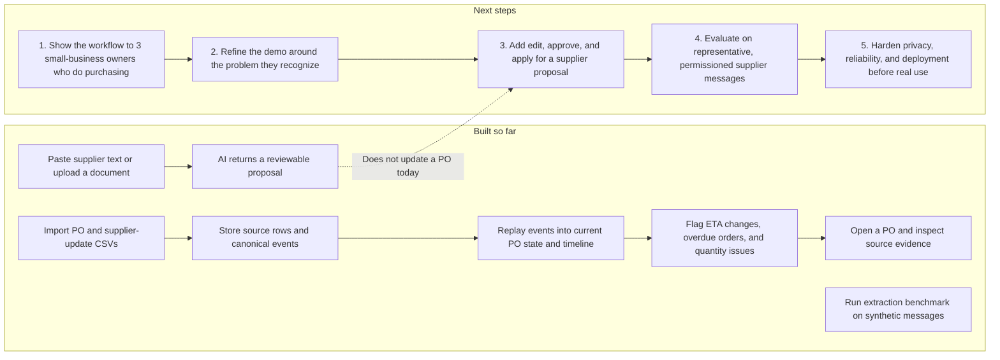

# ProcureBrain: project status and next steps

**Audience:** a small-business owner who handles purchasing themselves.  
**Status:** early prototype; useful core pieces exist, but the supplier-message workflow is not end to end and the problem has not yet been validated with target users.

## Map: built so far and what comes next

## What is implemented

- CSV import for purchase orders, supplier ETA updates, receipts, and follow-ups.
- Event replay into a current PO view and timeline.
- Deterministic attention rules for ETA changes, overdue POs, quantity shortfalls, receipt shortfalls, and overdue follow-ups.
- Source records retained and linked from timeline events.
- Separate supplier-text and document analysis that returns structured AI proposals for review.
- A first extraction benchmark on a 60-message **synthetic** holdout. It recorded 45% exact complete-record match and found weak review routing. This does not measure performance on real supplier traffic; see the [evaluation report](evaluations/2026-09-30-holdout.md).
- A product story and simple demo flow aimed at the small-business owner who handles purchasing.

## What is not complete

- The target problem is still a hypothesis. There is no recorded feedback from small-business owners confirming how often this problem occurs or what outcome they would value most.
- Supplier-message proposals are not connected to an edit, approve, or apply action. They do not create or change PO events.
- The app has no email inbox integration; updates enter through CSV or manual paste/upload.
- The benchmark is synthetic, small, and has known label inconsistencies. Real-world extraction and review safety are unknown.
- This is not a production-ready service. Validate privacy, access control, deployment, and operational recovery before handling live business or supplier records.

## Recommended order

### 1. Validate the pain before expanding the feature set

Show the short demo to three small-business owners who personally place or track supplier orders. Ask them to describe the last time a supplier changed a date or quantity, how they found out, and what they did next. Record their wording and whether the attention queue would have changed their next action. Do not ask whether they “like the app”; ask about their recent behavior.

**Decision:** if they recognize the problem, keep this as the first use case. If their recurring pain is different, revise the story before building the approval flow.

### 2. Make one demo path dependable

Demonstrate: import a PO with its original ETA → import a revised ETA → see the changed date and attention item → open the source evidence. The current code has been updated to use the original PO ETA as the comparison baseline. The latest code passed TypeScript typechecking; this turn did not rerun the test suite or verify this workflow in the browser.

### 3. Connect AI proposals to a safe human decision

After the user feedback supports this workflow, add a proposal review screen that shows the original source and extracted fields, lets the owner edit the values, and applies an approved proposal as a canonical event. Keep the source, reviewer decision, and resulting event linked for audit.

### 4. Re-evaluate with better labels and representative data

Review the current synthetic label taxonomy, keep the examined holdout untouched, and collect a permissioned, redacted set of representative supplier messages with reviewed labels. Measure field extraction and review routing separately before making accuracy claims.

### 5. Prepare for actual business use

Prioritize only after the workflow and data handling are clear: user access boundaries, backups and recovery, monitoring, deployment, and privacy/data-retention decisions.

## Immediate next action

Prepare a short demo and use it in three conversations with small-business owners who handle purchasing. Learn whether missed supplier changes are a frequent problem for them before committing to the larger AI approval workflow.
